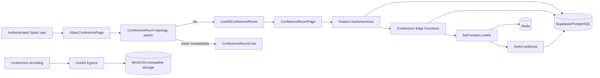

# Spark Video Conference — Architecture

**Status:** Phase 26 documentation  
**Repository:** `hamedplay/Spark`  
**Authoritative runtime:** self-hosted LiveKit SFU + Spark/Supabase business layer

## 1. Architectural model

Spark uses a **modular monolith for business logic** and a dedicated **LiveKit SFU media subsystem**.

The browser does not own conference authorization or lifecycle truth. PostgreSQL/Supabase is the authoritative source for room state, RBAC, meeting phase, waiting room, speaker queue/timer, persisted chat, polls, whiteboard, presentation state, recording metadata, audit events, and reconnect restrictions. LiveKit owns real-time media transport and SFU signaling.



## 2. Frontend composition

Current SFU path:

```text
src/components/VideoConference/VideoConferencePage.tsx
  -> ConferenceRoom.tsx
      -> media_topology === "sfu"
          -> src/features/video-conference/components/LiveKitConferenceRoom.tsx
              -> components/room/ConferenceRoomPage.tsx
                  -> LiveKitConferenceTools
                  -> ParticipantGrid
                  -> RoomMediaControls
                  -> MeetingPhaseOverlay
                  -> RecordingConsentBanner
                  -> SpeakerTimerBanner
                  -> WaitingRoomList
```

The feature implementation is under:

```text
src/features/video-conference/
  components/
  hooks/
  services/
  types/
  utils/
```

Important stable compatibility entrypoints are intentionally retained:

- `LiveKitConferenceRoom.tsx`
- `LiveKitConferenceTools.tsx`

The legacy Mesh path remains reachable for non-SFU historical/compatibility rooms through `ConferenceRoomCore.tsx`. It must not be deleted until a separate cutover proves that no supported room can still select Mesh.

## 3. Server-authoritative domains

The following domains are intentionally server-authoritative:

| Domain | Source of truth |
|---|---|
| Authentication/access level | Spark Auth + `get_my_auth_access_state` |
| Conference role/permissions | private RBAC tables/functions |
| Join eligibility/capacity | PostgreSQL join RPCs |
| LiveKit publish/subscribe grant | DB policy -> token Edge Function |
| Runtime moderation | DB authorization + LiveKit RoomService |
| Meeting phase | `conference_rooms` + `conference_phase_events` |
| Speaker queue/timer | `conference_speaker_sessions` |
| Waiting room | `conference_waiting_room` |
| Public/private/moderator chat | PostgreSQL + Edge authorization |
| Polls | PostgreSQL snapshot/action model |
| Whiteboard | PostgreSQL snapshots/pages + private storage |
| Presentation | PostgreSQL state + controlled storage |
| Recording | PostgreSQL metadata + LiveKit Egress/webhook reconciliation |
| Spotlight | `conference_spotlights` |
| Audit trail | `conference_audit_events` |

Direct client mutation of sensitive participant identity, lifecycle, role, LiveKit restriction fields, and phase state is guarded at the database boundary.

## 4. Media and signaling

For SFU rooms:

- LiveKit provides WebRTC signaling and SFU routing.
- Participant identity is the authenticated Spark user UUID.
- Camera, microphone, screen share, subscription, and data grants are derived from server-side conference policy.
- Runtime permission changes are synchronized to LiveKit with `RoomServiceClient.updateParticipant`.
- Reconnect events are handled by the LiveKit client path.
- Reactions use LiveKit data packets, while business state remains outside LiveKit.

For legacy Mesh rooms, Supabase Realtime/WebRTC signaling remains as a compatibility path.

## 5. Capacity model

There are three distinct limits that must not be conflated:

1. **Current live Spark runtime configuration:** `max_participants = 10`.
2. **LiveKit token/provisioning hard ceiling in code:** 20 participants.
3. **Phase 24 load harness:** designed for 20 total simulated participants.

The repository therefore supports the intended 20-participant validation target, but the current live database configuration is 10 and the existence of the load harness is not evidence that a 20-user production load test has already passed.

## 6. Security boundaries

Core rules:

- No LiveKit API secret or Supabase service-role key belongs in browser code.
- LiveKit tokens are short-lived and room-scoped.
- Anonymous conference authentication is rejected.
- Sensitive Edge Functions require authenticated Spark access state `FULL`.
- Public RPCs are narrow wrappers; privileged implementation is kept in `private`.
- RLS is enabled on all current conference tables.
- Storage buckets used by conference features are private and policy-scoped.
- Webhook events require LiveKit signature validation and event IDs for idempotency.

## 7. Key Edge Functions

Current conference-related functions include:

- `conference-livekit-token`
- `conference-host-control`
- `conference-recording`
- `livekit-webhook`
- `conference-chat-control`
- `conference-private-chat-control`
- `conference-moderator-chat-control`
- `conference-poll-control`
- `conference-whiteboard-control`
- `conference-presentation-control`
- `conference-reaction`
- `conference-speaker-queue-control`
- `conference-speaker-timer-control`
- `conference-speaker-timer-enforcer`
- `conference-phase-control`
- `conference-phase-enforcer`

## 8. Design rules for future changes

1. Keep PostgreSQL/Spark as business-policy authority.
2. Keep LiveKit as media transport authority, not business authorization authority.
3. Permission changes must update both durable DB state and LiveKit runtime state where relevant.
4. Realtime subscriptions synchronize clients; they are not a substitute for authoritative snapshots.
5. Every privileged mutation needs server-side authorization.
6. Every retryable lifecycle needs idempotency or reconciliation.
7. Preserve the Mesh compatibility seam until an explicit cutover phase removes it safely.
