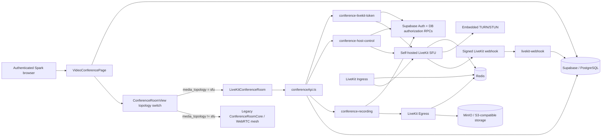

# Spark Video Conference — Current State (Phase 0 Baseline Audit)

**Audit date:** 2026-08-27  
**Repository:** `hamedplay/Spark`  
**Branch audited:** `main`  
**Baseline commit before this document:** `e1d54bbd8ca3ee8d80af4cc4f6463db557e4672c`  
**Database audited:** Supabase project `Spark` (PostgreSQL 17)  
**Scope:** audit/documentation only; no feature, schema, RLS, RPC, Edge Function, deployment, or runtime behavior changes.

## Phase

**PHASE 0 — Baseline Audit**

## Executive current state

Spark is not starting from a blank video-conference implementation. It currently has a **dual-runtime architecture**:

- `media_topology = 'sfu'` routes the room to the new self-hosted LiveKit implementation.
- non-SFU rooms route to the legacy browser-to-browser WebRTC mesh implementation.
- the active database runtime configuration is currently set to `media_topology = 'sfu'`.
- the database snapshot at audit time contains 78 ended mesh rooms and 1 ended SFU room, with no active rooms. This proves schema/runtime rollout has begun, but it does **not** prove 20-participant SFU production stability.

The architectural direction is already consistent with a modular monolith at the application layer: Spark/Supabase remains the business and authorization layer, while LiveKit is the media/SFU subsystem. The main gap is that the LiveKit path has not yet reached feature, policy, test, and observability parity with the legacy conference subsystem.

## Status matrix

| Area | Status | Evidence and interpretation |
|---|---|---|
| Media | **PARTIAL** | LiveKit SFU media is wired for SFU rooms with camera, microphone, screen share, active speaker, adaptive stream, dynacast, simulcast, reconnect events, and a 20-participant UI cap. Legacy mesh media still exists as a fallback runtime. No current 20-user load evidence exists. |
| Signaling | **PARTIAL** | LiveKit owns signaling for SFU rooms; legacy `conference_signals` / Supabase Realtime signaling remains for mesh rooms. Two signaling stacks must be maintained during cutover. |
| Authentication | **COMPLETE** | `conference-livekit-token` validates the bearer token with Supabase Auth, rejects anonymous actors, requires `get_my_auth_access_state().access_level = FULL`, and binds LiveKit identity to the authenticated Spark user UUID. |
| Authorization | **RISKY** | Server-side room and management authorization exists, but LiveKit token media grants are still coarse: every successful participant token receives `canPublish=true`, `canSubscribe=true`, and `canPublishData=true`. Business authorization and LiveKit media authorization are therefore not yet equivalent. |
| Waiting Room | **PARTIAL** | DB-backed waiting state exists; an SFU user receives no LiveKit token until admitted; host-side Realtime admission/rejection exists. Missing target lifecycle states such as `expired`, admit-all UX, and explicit concurrency/race test coverage. |
| Roles | **PARTIAL** | Current DB roles are `host/admin/moderator/member/guest`. Runtime guest authentication has been removed, but the legacy `guest` role remains in schema/type constraints. Target roles such as owner/co-host/presenter/viewer do not yet exist as the requested model. |
| Permissions | **RISKY** | Database helpers such as `private.can_manage_conference` enforce management actions, but there is no independent conference permission model matching the requested permission catalogue. Frontend manager checks are still role-based, and LiveKit grants are hard-coded. |
| Chat | **PARTIAL** | Public chat persists in `conference_messages` and is delivered via Supabase Realtime. SFU UI currently implements basic send/history only. Existing DB fields support some richer legacy behavior, but edit/delete/reply/reaction/mention/rate-limit parity and private/moderator channels are not complete in the SFU path. |
| Hand Raise | **PARTIAL** | Hand raise is server-persisted with `is_hand_raised` and `hand_raised_at`, ordered in the SFU participant UI, and moderators can lower a hand. It is not yet a full authoritative speaker queue and is not integrated with a server-authoritative speaker timer. |
| Screen Share | **PARTIAL** | LiveKit screen publishing and presentation of the current screen sharer are implemented. Permission enforcement is not derived from the requested business permission model, and presentation/file sharing is separate future work. |
| Reaction | **PARTIAL** | SFU reactions use transient LiveKit Data Packets on topic `spark-reaction`. Current payload/UI is only emoji + timestamp and a single transient global display; sender identity/name/avatar, simultaneous reaction UX, and rate limiting are absent. |
| Recording | **RISKY** | RoomComposite Egress + S3-compatible storage + DB metadata exist. However `conference-host-control` uses lifecycle names `starting/active/stopping/complete`, while the DB constraint and `conference-recording` use `queued/recording/processing/ready/failed/cancelled`. This can prevent room-end recording shutdown/reconciliation and is a concrete lifecycle defect to fix in a later recording phase. |
| Webhook | **PARTIAL** | LiveKit webhook signature validation is implemented. DB processing records events, rejects duplicate `event_id` replays idempotently, and synchronizes room/participant/egress state. There is no conference integration test proving replay, timeout, and recovery behavior end-to-end. |
| TURN | **RISKY** | Embedded TURN is configured and documented, including UDP 443 and TURN/TLS. The compose runtime config and standalone `livekit.yaml` diverge, and TURN/TLS is configured on TCP 5349 without evidence of the L4/load-balancer path that current LiveKit guidance expects when TLS TURN is not directly on 443. No restrictive-network connectivity test was executed in this audit. |
| Redis | **PARTIAL** | Self-hosted Redis is loopback-bound, protected-mode enabled, and AOF persistence is enabled. LiveKit/Egress/Ingress share it correctly on the single-host topology. The current `127.0.0.1` addressing is intentionally single-host and must be externalized for horizontal multi-node LiveKit later. |
| Ingress | **PARTIAL** | A dedicated LiveKit Ingress service is configured for RTMP/WHIP with Redis, health, Prometheus, and UDP 7885. No Spark user flow or integration test currently demonstrates authorized ingress creation/use. |
| Egress | **PARTIAL** | Dedicated Egress worker, Redis, health, Prometheus, and S3-compatible output are configured. Recording API calls it successfully at code level, but lifecycle inconsistency and missing end-to-end tests prevent production-ready classification. |
| Object Storage | **PARTIAL** | Self-hosted MinIO is present, bound to loopback, initialized with a recording bucket, and used by Egress through S3-compatible configuration. It is single-node and currently scoped to recording; presentation/whiteboard snapshot storage is not implemented. |
| Monitoring | **MISSING** | LiveKit/Egress/Ingress expose Prometheus ports, but the repository contains no Prometheus server, Grafana, Loki, or Alertmanager deployment/dashboard stack for conference observability. Exporters alone are not an observability system. |
| Testing | **MISSING** | No conference/LiveKit-specific automated test files were found under `tests/`. Existing repository tests cover other application domains. There is no 2-user, 20-user, token, host-action, recording, webhook-idempotency, reconnect, or TURN fallback suite. |

## Runtime architecture



### Runtime selection

`src/components/VideoConference/ConferenceRoom.tsx` is the bridge:

- SFU rooms render `src/features/video-conference/components/LiveKitConferenceRoom.tsx`.
- all other rooms render the legacy `ConferenceRoomCore.tsx`.

This is a controlled migration seam and should be preserved until feature parity and migration/cutover criteria are explicitly satisfied. Removing the legacy path in Phase 0 would be unsafe.

## Dependency graph

### Frontend path

```text
VideoConferencePage.tsx
  -> ConferenceRoom.tsx
       -> [SFU] LiveKitConferenceRoom.tsx
            -> livekit-client
            -> LiveKitParticipantTile.tsx
            -> LiveKitConferenceTools.tsx
            -> services/conferenceApi.ts
            -> Supabase Realtime / PostgreSQL
            -> Supabase Edge Functions
       -> [mesh] ConferenceRoomCore.tsx
            -> legacy WebRTC hooks/components
            -> Supabase Realtime signaling
```

### Backend/media path

```text
conference-livekit-token
  -> Supabase Auth
  -> get_my_auth_access_state
  -> prepare_livekit_conference_join
  -> LiveKit RoomServiceClient
  -> short-lived room-scoped LiveKit JWT

conference-host-control
  -> get_my_auth_access_state
  -> authorize_livekit_host_action
  -> LiveKit RoomServiceClient / EgressClient
  -> moderation/role/lock/end RPCs
  -> conference_audit_events

conference-recording
  -> get_my_auth_access_state
  -> authorize_livekit_recording
  -> LiveKit Egress
  -> MinIO/S3
  -> conference_recordings

LiveKit
  -> livekit-webhook
  -> WebhookReceiver signature validation
  -> apply_livekit_webhook_event_v1
  -> private.apply_livekit_webhook_event
  -> conference/recording state
```

## Repository inventory

### New SFU feature layer

```text
src/features/video-conference/
  components/LiveKitConferenceRoom.tsx
  components/LiveKitConferenceTools.tsx
  components/LiveKitParticipantTile.tsx
  services/conferenceApi.ts
```

### Legacy / compatibility conference layer

The repository still contains the larger original subsystem under:

```text
src/components/VideoConference/
```

This includes lobby, mesh WebRTC, chat, poll, whiteboard, diagnostics, breakout, moderation, layout, and controls. It remains reachable through the topology switch and is therefore **not dead code**.

### Edge Functions

Exact conference/LiveKit Edge Functions found:

```text
supabase/functions/conference-livekit-token/index.ts
supabase/functions/conference-host-control/index.ts
supabase/functions/conference-recording/index.ts
supabase/functions/livekit-webhook/index.ts
```

### Self-hosted media deployment

```text
deploy/livekit/
  docker-compose.yml
  livekit.yaml
  egress.yaml
  ingress.yaml
  redis.conf
  Caddyfile
  .env.example
  README.md
```

Services in the primary compose stack:

- LiveKit Server / SFU
- embedded TURN
- Redis
- LiveKit Egress
- LiveKit Ingress
- MinIO
- Caddy
- MinIO bucket initializer

## Database inventory

The repository currently contains **no `supabase/migrations/` directory** at the audited head. The database itself does contain migration history, including conference migrations. Therefore the database was inspected directly and is the only complete source available for the current conference schema in this phase.

Exact conference/LiveKit tables found in the live database:

```text
conference_archives
conference_attendance_events
conference_audit_events
conference_breakout_assignments
conference_breakout_rooms
conference_live_captions
conference_messages
conference_participants
conference_poll_votes
conference_polls
conference_preflight_results
conference_quality_metrics
conference_reactions
conference_recordings
conference_rooms
conference_signals
conference_transcript_segments
conference_transcripts
conference_waiting_room
conference_whiteboard
livekit_webhook_events
```

RLS is enabled on every table above. `livekit_webhook_events` has RLS enabled with no client policy, consistent with privileged backend-only access.

### Core current constraints

- `conference_rooms.media_topology`: `mesh | sfu`
- `conference_rooms.status`: `waiting | active | ended`
- mesh room capacity is constrained to at most 6 at DB level
- `conference_participants.role`: `host | admin | moderator | member | guest`
- `conference_participants.status`: `waiting | joined | left`
- `conference_waiting_room.status`: `waiting | admitted | rejected`
- `conference_recordings.status`: `queued | recording | processing | ready | failed | cancelled`

### Current public conference/LiveKit RPC surface

Exact functions found include:

```text
admit_livekit_conference_participant
apply_livekit_webhook_event_v1
assign_conference_breakout
authorize_livekit_host_action
authorize_livekit_recording
ban_conference_participant
check_conference_join
claim_conference_presenter
clear_conference_breakout_assignment
clear_conference_whiteboard
conference_heartbeat
create_conference_breakouts
create_conference_room
create_meeting_livekit_conference
end_conference_breakouts
end_conference_room
get_video_conference_runtime_config
join_conference_room
leave_conference_room
moderate_conference_participant
mute_all_conference_participants
prepare_livekit_conference_join
release_conference_presenter
resolve_conference_room
set_conference_chat_enabled
set_conference_participant_role
set_conference_participant_speaking_limit
set_conference_pinned_user
set_conference_room_password
set_conference_speaking_limit_enabled
set_livekit_raise_hand
set_livekit_room_lock
touch_my_conference_session_activity
transfer_conference_host
```

The public LiveKit wrappers generally delegate to private authorization/business functions with an empty `search_path`. Sensitive state transitions such as join authorization, host actions, recording authorization, waiting-room admission, role change, hand raise, and webhook application are server-side.

## Current SFU join/security flow

1. Browser invokes `conference-livekit-token` with the Spark bearer token.
2. Edge Function calls `auth.getUser()`.
3. Anonymous users are rejected.
4. `get_my_auth_access_state` must report `FULL` access for the same user.
5. `prepare_livekit_conference_join` validates room topology/state/expiry/lock/ban/membership/waiting room/capacity.
6. A waiting participant receives **no** LiveKit token.
7. LiveKit room is provisioned server-side when absent.
8. JWT identity is the Spark user UUID and is scoped to one LiveKit room.
9. Token TTL is 10 minutes.
10. The current weakness is the coarse grant set: all admitted roles receive publish/subscribe/data permission.

No LiveKit API secret or service-role secret is present in the inspected frontend SFU code.

## Current deployment topology

The checked-in production model is a single-host, self-hosted media node:

```text
Internet clients
  -> Caddy :443
      -> LiveKit signaling/API :7880 (loopback-facing through proxy)

WebRTC media
  -> LiveKit UDP 50000-60000
  -> ICE/TCP 7881
  -> embedded TURN/UDP
  -> embedded TURN/TLS

LiveKit / Egress / Ingress
  -> Redis 127.0.0.1:6379

Egress
  -> MinIO 127.0.0.1:9000

Ingress
  -> RTMP :1935
  -> WHIP HTTPS via Caddy + UDP :7885
```

Redis and MinIO are not exposed publicly by the checked-in configuration.

## Versions observed

| Component | Repository version |
|---|---|
| LiveKit Server image | `v1.13.5` |
| LiveKit Egress image | `v1.13.0` |
| LiveKit Ingress image | `v1.5.0` |
| `livekit-client` | `2.22.0` |
| `livekit-server-sdk` in Edge Functions | `2.18.0` |
| `@supabase/supabase-js` | `2.112.3` |
| React | `^19.0.0` |
| TypeScript | `6.0.3` |

Official upstream documentation/release pages were checked on 2026-08-27 before this audit was finalized. `livekit-server-sdk@2.18.0` remains the current npm release, while npm reports `livekit-client@2.22.1` as the current client release. Spark is therefore one patch behind on the browser client. **No dependency upgrade is made in Phase 0.**

References:

- https://docs.livekit.io/transport/self-hosting/
- https://docs.livekit.io/transport/self-hosting/deployment/
- https://docs.livekit.io/transport/self-hosting/ports-firewall/
- https://docs.livekit.io/transport/self-hosting/egress/
- https://docs.livekit.io/transport/self-hosting/ingress/
- https://www.npmjs.com/package/livekit-client
- https://www.npmjs.com/package/livekit-server-sdk

## Technical debt and concrete risks

### P0 — LiveKit permission enforcement is too coarse

**Finding:** token issuance currently grants every admitted participant:

```text
canPublish: true
canSubscribe: true
canPublishData: true
```

**Impact:** PostgreSQL role/policy decisions cannot currently restrict microphone, camera, screen, or data publishing at the LiveKit transport layer.

**Required later:** build an explicit conference permission model and derive LiveKit `VideoGrant` / publish-source permissions from server-authoritative policy. Runtime role changes must also update LiveKit participant permissions.

### P0 — Recording lifecycle vocabulary is inconsistent

**Finding:**

- DB and `conference-recording`: `queued -> recording -> processing -> ready|failed|cancelled`
- `conference-host-control` room-end path searches for `starting|active|stopping` and attempts to write `complete`

Those latter states are not accepted by the current DB check constraint.

**Impact:** ending a meeting can fail to find/stop active Egress work using the expected DB state vocabulary, and `complete` is not a valid persisted status.

**Required later:** unify lifecycle constants, make webhook state authoritative, and add reconciliation/idempotency tests. Do not patch this in Phase 0.

### P1 — Dual conference runtimes create parity debt

**Finding:** `ConferenceRoom.tsx` keeps both LiveKit SFU and legacy mesh paths active.

**Impact:** feature behavior can differ by `media_topology`; security and bug fixes may need two implementations until cutover.

**Decision for now:** preserve this seam. Remove legacy only after measured SFU parity, migration, and rollback criteria are complete.

### P1 — SFU components are already above architecture size guidance

Measured current files:

| File | Lines |
|---|---:|
| `LiveKitConferenceRoom.tsx` | 339 |
| `LiveKitConferenceTools.tsx` | 273 |
| `LiveKitParticipantTile.tsx` | 49 |
| `conferenceApi.ts` | 79 |
| legacy `ConferenceRoomCore.tsx` | 692 |

`AGENTS.md` recommends UI components around 200 lines and requires justification beyond 300 lines. `LiveKitConferenceRoom.tsx` has connection lifecycle, media controls, waiting room, reactions, participant projection, and layout in one component. It is a valid Phase 1 refactor target without changing behavior.

### P1 — Deployment config has duplicate sources

`docker-compose.yml` injects `LIVEKIT_CONFIG` directly, while `deploy/livekit/livekit.yaml` also contains a server configuration. They are not identical; for example TURN UDP differs.

**Impact:** an operator can validate/edit one file while runtime uses the other.

**Required later:** establish one authoritative configuration path and mechanically validate generated/runtime config.

### P1 — TURN/TLS deployment needs topology verification

Current official LiveKit deployment guidance states that without a load balancer, TURN/TLS should be exposed on TCP 443. Spark's checked-in stack uses Caddy on TCP 443 and TURN/TLS on TCP 5349, while the README notes that a dedicated public IP or L4 load balancer is needed if TURN/TLS must be on 443.

**Impact:** restrictive enterprise networks that permit only TLS-like traffic on TCP 443 may fail TURN/TLS fallback unless the documented L4/dedicated-IP arrangement exists in the real environment.

**Required later:** validate the actual production network topology; do not infer from repository config alone.

### P1 — No conference automated test suite

There are no conference-specific automated tests in `tests/`.

**Impact:** token issuance, authorization, waiting-room races, webhook replay, recording lifecycle, reconnect, and 20-user behavior can regress undetected.

### P1 — Observability is only exporter-level

Prometheus ports are configured on LiveKit/Egress/Ingress, but no scraper, dashboards, logs aggregation, alert rules, or Alertmanager stack is present.

**Impact:** the application cannot currently demonstrate production SLOs or quickly isolate SFU/TURN/Egress failures from repository-provided observability.

### P1 — Database migration reproducibility gap

The live database has conference migration history, but the current repository head contains no `supabase/migrations/` directory.

**Impact:** schema evolution cannot be fully reconstructed from repository history at the current head. Future DB work must create new migrations without rewriting the existing live migration history.

### P2 — Stale guest role remains after guest-auth removal

Recent DB migration history includes removal of the guest-auth architecture, and current token issuance rejects anonymous actors, but `guest` still exists in participant role constraints and TypeScript role types.

**Impact:** terminology and policy surface are larger than the actual supported authentication model.

**Required later:** prove no legitimate dependency before cleanup; do not remove in Phase 0.

### P2 — Secret-bearing TURN settings exist in application configuration

The database contains TURN server/username/credential configuration fields. Their values are intentionally omitted from this document.

**Impact:** the security classification and read access of these settings must be audited before relying on them as a long-term credential store.

## Architecture assessment against the target

The requested target architecture is fundamentally compatible with the current direction:

```text
Clients
  -> Spark Conference Backend / Supabase
  -> LiveKit SFU
      -> TURN/STUN
      -> Redis
      -> Egress
      -> Ingress
  -> PostgreSQL
  -> Object Storage
```

What is already structurally correct:

- self-hosted LiveKit is separated from Spark business authorization
- browser never receives the LiveKit API secret
- token issuance is server-side and room-scoped
- Postgres remains the business state source for room membership/roles/waiting/audit
- Egress and Ingress are separate workers
- Redis is used by LiveKit/Egress/Ingress
- object storage is S3-compatible and self-hosted
- SFU room capacity is bounded server-side to 20
- webhook signature validation and replay idempotency are present
- the frontend has a clean topology seam for incremental migration

What is not yet production-complete:

- independent RBAC/permission model
- LiveKit permission derivation/enforcement
- full feature parity of the SFU UI
- authoritative speaker/meeting timers
- private/moderator chat
- production whiteboard/presentation subsystem
- richer diagnostics
- hardened recording lifecycle/reconciliation
- production observability stack
- conference-specific automated integration/E2E/load tests
- verified 20-user and restrictive-network runtime evidence

## Phase 0 root-cause conclusion

The main cause of the current gaps is **an incomplete architecture cutover rather than a missing SFU foundation**. Spark already introduced the correct major primitives—LiveKit SFU, token Edge Function, server-side DB authorization, Egress, Ingress, Redis, object storage, signed webhooks—but feature migration happened before a unified permission model, lifecycle vocabulary, test suite, and observability layer were completed.

Therefore the safe next step is **not a rewrite**. Phase 1 should modularize the SFU frontend without changing behavior, while preserving the topology bridge and backend contracts. RBAC and LiveKit permission enforcement should remain distinct later phases because they change security semantics.

## Phase 0 validation boundary

This audit validates **repository and live database state**, not media-server reachability.

Validated in Phase 0:

- actual `main` file tree and runtime topology switch
- actual package versions
- actual Edge Function implementations
- actual LiveKit deployment configuration
- actual live PostgreSQL tables, constraints, RLS enablement, migration history, and conference/LiveKit RPCs
- current video-conference runtime configuration
- current upstream LiveKit documentation/release compatibility review

Not proven by this phase:

- deployed LiveKit host health
- firewall reachability
- TURN/UDP or TURN/TLS success from restrictive networks
- Egress upload against the deployed MinIO instance
- Ingress RTMP/WHIP runtime behavior
- 20 simultaneous participants
- packet-loss/reconnect behavior
- end-to-end browser compatibility

Those require runtime and load/integration validation in later phases.

## Phase 0 change record

- **Files changed:** only `docs/video-conference/current-state.md`
- **Database changes:** none
- **Migrations added:** none
- **Feature behavior changes:** none
- **Dependency changes:** none
- **Deployment changes:** none
